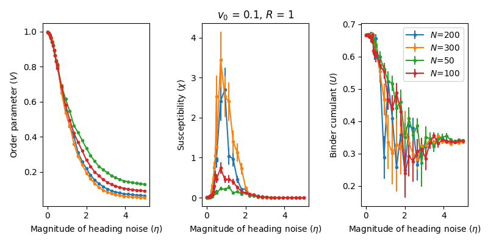
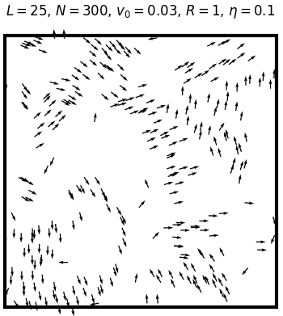
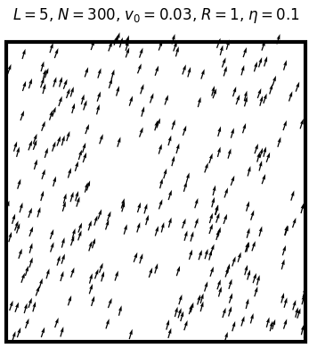

# Vicsek

An implementation of the 2-dimensional Vicsek model<sup>1</sup> of interacting self-propelled particles, written in Python.

Written by Joe Marsh Rossney in Spring 2017 as part of a group project at the University of Warwick.
Updated in Autumn 2018 to include error estimates and parallel functionality.

## Getting started

### Prerequisites

All you need to run a simulation are the [NumPy, SciPy and Matplotlib packages](https://www.scipy.org/install.html).

To take advantage of the parallel functionality, you also need to install [GNU Parallel](https://www.gnu.org/software/parallel/).

### Installing

Clone the repository using
```
git clone https://github.com/marshrossney/Vicsek.git
```
or just download and unzip.

## Instructions for use

### Choosing simulation parameters

All user-controlled parameters can be found in `params.py` along with descriptions and instructions for use.
The key tunable parameters, described in the included *Vicsek.pdf*, are denoted by:
* `N_list` - the number of particles
* `v0_list` - the magnitude of the particle velocity
* `R_list` - the interaction radius
* `eta_list` - the magnitude of the noise

Upon execution the program will cycle through all combinations of the four parameters listed above, running `repeats` independent simulations for each parameter combination.


### Running a simulation: serial

To run simulations on a single processor is as simple as
```
python main.py
```
You should see useful information on the progress of the simulations.

### Plotting the results

For each combination of parameters, the program will output the average values of the order parameter, the susceptibility and the Binder cumulant (plus their errors).
Information about these quantities can be found in *Vicsek.pdf*.

The plotting script takes two command-line arguments: *(1)* the independent (x-axis) variable, and *(2)* a variable for which different values will correspond to separate lines.
The four possible arguments are: `N v0 R eta` which correspond to the four parameter lists in `params.py`.
Data corresponding to different values of the two parameters not given as arguments will be plotting on entirely separate figures.

For example, if you ran simulations with **3** different sizes, **2** velocities, **2** interaction radii and **20** different values for the noise parameter, then running
```
python plot.py eta N
```
would plot **4** separate figures, each with **3** lines consisting of **20** points.
If you add a third argument `save` the figures will be saved in a pdf.

Example:


### Running a simulation: parallel

The parallel functionality is limited to parallelisation over different values of the noise parameter found in `eta_list` (see **Comments** section for a justification for this).

Choose the number of parallel processes to run by specifying `Np` in `params.py`.
It is also a good idea to set the number of values in `eta_list` as an integer multiple of `Np`, since that will result in the most even work balance.

Run parallel simulations by executing
```
./run_parallel.sh
```
You may need to first make it into an executable script using
```
chmod +x ./run_parallel.sh
```
Each process will save results to it's own output file `save_name_pX`, where `save_name` is given in `params.py` and `X` is the process index.
Upon completion of all simulations, these output files will be combined into one, which can be plotted as normal.

Unfortunately the progress of the simulations will not be shown on the screen as it is with serial runs.
However, using `wc -l save_name_pX.out` to print the number of lines in an output file tells us how many parameter combinations have been completed.

### Running an animation

Animations are useful for gauging a good set of parameters, and they look cool.

The animation will choose the first parameters from `N_list`, `v0_list` and `R_list`, but will ignore `eta_list` and instead cycle through noise values based on the parameters given at the bottom of `params.py`.

It is also possible to plot the order parameter and susceptibility throughout the animation, by setting `do_plots = True`. This may slow things down, especially for animations with many particles.

To run an animation, simply run
```
python animation.py
```


### Additional functionality

#### Plotting the state of the system

The plotting script has an additional feature which is that it can plot the state - the positions and headings of all the particles - at a single (the final) timestep - a 'snapshot'.
To do this, you need to set `save_snapshots = True` in `params.py`, and then run
```
python plot.py state filename
```
where `filename` is the file containing the data you wish to plot.
Add a third argument `save` to save the figure.
This leads to figures like:

 


#### Estimating the required burn-in time

There is a script called `burn-in.py` which runs simulations with zero noise and measures how long it takes for them to 'burn in' (the criterion is that the order parameter must exceed 0.98).
Run this script as
```
python burn_in.py
```
The idea of this was to be able to set a scaling relation between the burn-in time and the number of atoms for that particular combination of `v0` and `R`.
However, this **appears to underestimate** the required burn-in time for large simulations with low but non-zero noise.
If you really want to get good results, I'd suggest using the animated plots to estimate the burn-in time for a specific set of parameters.

#### Leaders

You can add some 'leaders' - particles with larger interaction weights and radii, or with a fixed trajectory - by setting the appropriate parameters in `params.py`.


## Comments

#### A comment on the parallelisation

I've only bothered to parallelise over different values in `eta_list` since:
* The noise is the parameter most commonly varied, since the phase transition is most easily seen by doing so.
* It is the only one of the four iterable parameters not to affect the average run-time of a simulation, therefore offering the most even work balance.
* It makes the parallelisation *ludicrously* simple to implement. Like ~10 extra lines of code in `main.py`.

#### The attached pdf

A *very brief* description of the mathematics of the model is provided in *Vicsek.pdf*, along with some illustrative figures and links to further reading.

## References
<sup>1</sup> T. Vicsek *et al.*, Phys. Rev. Lett. **75**, 1226 (1995)
