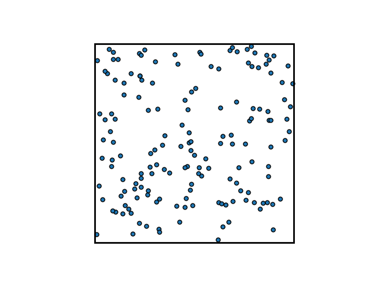
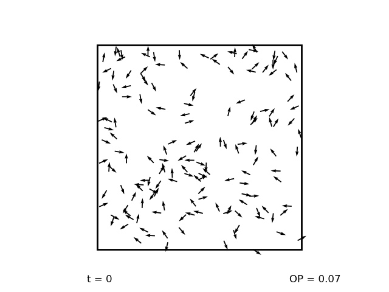
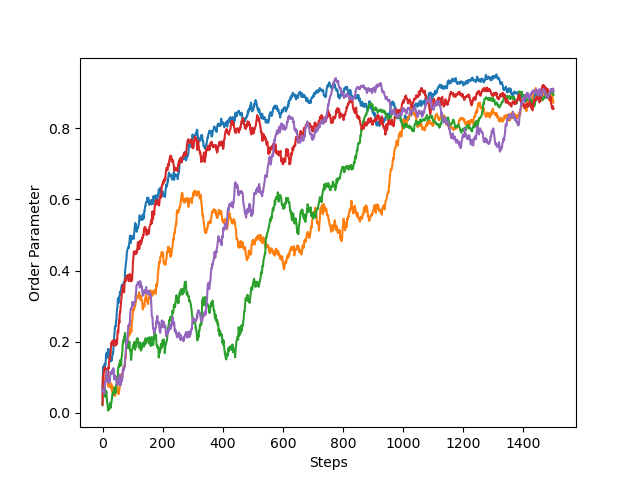

# Vicsek

An implementation of the two-dimensional Vicsek model<sup>1</sup> of interacting self-propelled particles.

Originally written in Python 2 as part of an undergraduate group project back in 2017. Recently updated to Python 3 and completely reformulated because people had actually been forking some embarrassingly shit code for their projects and I felt very guilty.

Intended to spark joy :)

## Installation

### Basic installation

Clone the repo using one of the numerous available options, e.g.

```
git clone https://github.com/marshrossney/vicsek.git
cd vicsek
```

Next, create the Conda environment provided in this repository

```
conda create -f environment.yml -n vicsek
conda activate vicsek
```

and then install the package into this environment

```
python -m pip install -e .
```

This is technically all you need to be able to import modules into your scripts.

To run the scripts in `vicsek/scripts/` from the command line, you will also need to install ConfigArgParse.

```
conda install -c conda-forge configargparse
```

### Development

If you want to extend or modify the code I would suggest creating a 'development' environment,

```
conda create -n vicsek-dev --clone vicsek
conda activate vicsek-dev
```

and installing whatever packages you would like to use for development, e.g.

```
conda install -c anaconda ipython
conda install -c conda-forge jupyterlab black
```

### Testing

If you're making changes it's a good idea run tests to make sure the changes didn't introduce unexpected behaviour. 

```
conda install -c anaconda pytest flake8
```

When executed in the base directory of the repository, the following lines will lint the code and run any existing unit tests.
```
flake8 .
pytest
```

### Installation without Conda

The requirements are basically just
* Python 3.9
* Reasonably up-to-date versions of NumPy, SciPy and Matplotlib
* tqdm

It should be fine to just install these via e.g. `pip install`, but I haven't tested it.

## Usage

### In scripts

The most basic usage is

```python
import matplotlib.pyplot as plt

from vicsek.model import VicsekModel
from vicsek.visualize import ParticlesAnimation

model = VicsekModel(
    length=10,
    density=0.5,
    speed=0.3,
    radius=0.6,
)

# View a snapshot of the particles
snapshot = model.view()
plt.show()

# Run an animation
animator = ParticlesAnimation(model)
animation = animator.animate()
plt.show()
```

### Command line

Installing with `pip install -e .` will also make the scripts in `vicsek/scripts/` available via the command line. There are currently three scripts:

1. `vic-ani` : Generate an animation and save it as a GIF
2. `vic-snap` : Generate a sequence of static images at regular intervals in the evolution
3. `vic-ens` : Evolve an ensemble of models with different initial conditions and dynamically track the evolution of the order parameter

These scripts take certain arguments which may be provided directly, as in

```
vic-ani --length 10 --density 0.4 --speed 0.5 --frames 100 --steps 10
```

or (probably more sensible) using a YAML configuration file (names `input.yml` below),

```
vic-ani --config input.yml
```

For examples of configuration files see `examples/runcards/`

### Making an animation

There are two main options:

1. Save the output of `ParticlesAnimation.animate`
2. Stitch together a sequence of static images produced by `VicsekModel.view`

Option 1 can be as simple as replacing `plt.show()` with `animation.save("animation.gif")` in the example above. You can also use the dedicated script `vic-ani`.



Option 2 is best done by running `vic-snap` and using an external tool to stitch together the resulting images. Below is a demonstration using ImageMagick's `convert`.

```
vic-snap -c input.yml
cd snapshots/
convert -delay 5 -loop 0 *.png animation.gif
```



### Evolution of the order parameter

The purpose of `vic-ens` is to visualize the evolution of the order parameter for an ensemble of models. This is useful if one is interested in figuring out how long the system takes to 'burn in', i.e. to effectively lose memory of its initial conditions.



### Modifying the appearance of plots and animations

You can modify the matplotlib style sheets in `vicsek/style/` or [create your own](https://matplotlib.org/stable/tutorials/introductory/customizing.html). To use a style sheet in a Python script include the following:

```python
import matplotlib.pyplot as plt

plt.style.use("path/to/custom.mplstyle")
```

Alternatively, pass the style sheet on the command line, e.g.
```
vic-evol -c input.yml --style custom.mplstyle
```

## Getting help

To bring up the docstrings on Python objects use the `help` command. For example,

```python
from vicsek.visualize import ParticlesAnimation
help(ParticlesAnimation.animate)
```

will bring up the docstring describing how to use this method.

To get help on the command-line scripts use the `-h` flag:

```
vic-ani -h
```

## To do

- [ ] Improve the speed (see #4)
- [ ] Allow for saving and loading from checkpoint files
- [ ] Add example config files and outputs, e.g. to replicate original results of the original paper
- [ ] Add a couple of Jupyter notebooks to demonstrate usage
- [ ] Implement some more active matter models - Active Brownian Particles, Metric-free Vicsek etc.
- [ ] Upgrade configargparse to jsonargparse because it looks really nice

## References
<sup>1</sup> T. Vicsek *et al.*, Phys. Rev. Lett. **75**, 1226 (1995)
